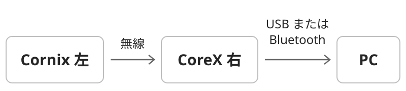

# coreX RMK Firmware

**トラックボール付き coreX 右と、純正 Cornix 左を組み合わせて使うためのファームウェアです。**

対象は **coreX A13 右基板＋J4 接続の PAW3222**。右から PC へ USB／Bluetooth 接続し、左右のキー・トラックボール・エンコーダを使えます。配列、ボールの感度、スクロール量、AML は Vial で変更できます。

> このリポジトリは coreX 用の開発版です。Cornix メーカーの公式配布ファームとは別です。純正 Cornix 左には、ここで配布する左用ファームを書き込みます。

## 受け取って、まず使う

**書き込み済みのセットなら、ビルドも書き換えも不要です。**

1. 左右の電源を ON にします。
2. **右側を PC に USB 接続**します。左側は無線で右につながります。
3. 左右の文字キーとボールを試します。

| やりたいこと | 初期配列での操作 |
| --- | --- |
| ポインター移動 | ボールを回す |
| 左／中／右クリック | ボールを動かした直後に **J／K／L** |
| スクロール | **I を長押ししながらボールを回す** |
| 普通の I を入力 | I を短く押して離す |
| 右エンコーダ | 回転：上下スクロール、押し込み：Esc |
| 左エンコーダ | 回転：音量、押し込み：ミュート |

ボール操作で約700 msだけクリック用のレイヤーへ切り替える **AML（Auto Mouse Layer）** が初期状態で ON です。感度・スクロールと同様に、Vial から OFF にできます。

電池で使う場合は、PC の Bluetooth に **`coreX Pair RMK`** を登録します。左右の無線接続と PC の Bluetooth 登録は別です。詳しくは [接続・操作ガイド](docs/usage.md#pc-と-bluetooth-接続する) を参照してください。

## Vial で、自分の使いやすい設定にする

[Vial アプリ](https://get.vial.today/)を開き、**右側を USB 接続**します。下の画像がこの構成の実機画面です。

*撮影機の保存済み配列です。右親指の T は個別の変更で、配布初期値は MO(1) です。保存済みの設定がある個体では、その設定が優先されます。*

- **普通のキー：** 上の配列からキーを選び、下の一覧から割り当てを選びます。
- **ボールの設定：** Layer 0 で、円の中の「感度」「Scroll」または円の下の「AML」を選び、下の **User** タブ（Tap Dance と Macro の間）から設定値を選びます。
- **エンコーダ：** 配列の右外側にある丸4つを選びます。左の2つが左エンコーダ、右の2つが右エンコーダで、それぞれ反時計回り／時計回りです。押し込みは配列内の四角い Mute／Esc で設定します。

**円の中と下の3枠は、実物のボタンではなく設定欄です。** キー割り当てと同じ操作で値を保存します。枠を繰り返し押して増減させる仕組みではありません。

| 設定 | 選べる値 | 配布初期値 |
| --- | --- | --- |
| 感度 | 0.5／1／1.5／2／3／4倍。縦横共通 | **2倍** |
| Scroll | 停止／最速／速い／標準／遅い／微速。縦横共通 | **標準** |
| AML | ON／OFF | **ON** |

変更は本体に保存され、再起動しても残ります。Scroll はボールのスクロール量にだけ効きます。OS 側のポインター速度やスクロール設定も操作感に影響します。

詳しい設定方法、5つのレイヤー、Bluetooth の接続先切り替え、困ったときの確認は **[使い方](docs/usage.md)** にまとめています。

## 純正 Cornix との違い

| 項目 | 純正 Cornix | この coreX 構成 |
| --- | --- | --- |
| PC へ接続する側 | 左 | **右** |
| 左右の組み合わせ | 純正の左右ファーム | coreX 右＋付属 Peripheral ファームを入れた純正左 |
| トラックボール | この PAW3222 拡張はなし | 右 J4 の PAW3222、クリック・スクロール・AML |
| Vial | 純正の配列・設定 | coreX 用配列＋感度・Scroll・AML の設定欄 |
| エンコーダの表示 | 回転用の丸4つ | 同じ表示形式。右親指付近にトラボ設定の円を追加 |
| 初期キー配列 | メーカー配列 | coreX 用5レイヤー。純正の保存配列をそのまま流用する前提ではありません |
| 状態 LED | 接続・電池状態などの表示 | **純正の状態表示は未移植**。LEDだけで接続状態を判断しないでください |

純正の接続方法は [メーカー日本語マニュアル](https://docs.channel.io/jezailfunderjp/ja/articles/Cornix-%E6%97%A5%E6%9C%AC%E8%AA%9E%E3%83%9E%E3%83%8B%E3%83%A5%E3%82%A2%E3%83%AB-c1160246) に基づきます。純正の無線ドングル、省電力動作、電池持ちとの同等性は確認していません。

**今回の v0.9.2 はトラックボール専用です。** トラックポイント、IQS9151 タッチパッドの処理は含めていません。

## ファームウェアを入れる・更新する

**[受け渡し用 ZIP をまとめてダウンロード](https://github.com/yuchamichami/corex-rmk-firmware/releases/latest/download/coreX-firmware-hand-off.zip)** — 左右の UF2、説明画像、ソース、ライセンスを同梱しています。

| 対象 | バージョン | ダウンロード |
| --- | --- | --- |
| **右：coreX A13＋PAW3222** | v0.9.2 | [右用 UF2](firmware/coreX-A13-Right-Central-PAW3222-RMK-v0.9.2.uf2) |
| **左：純正 Cornix** | v0.9.0 | [左用 UF2](firmware/coreX-Cornix-StockLeft-Peripheral-RMK-v0.9.0.uf2) |

左右のバージョンが異なるのは正常です。この2つを組み合わせて使います。**左右のファイルは入れ替えないでください。** 左 v0.9.0 を導入済みなら、今回の更新は右だけです。

ファイルのページを開いたら **Download raw file** で保存します。右・左それぞれの RESET を素早く2回押し、現れた USB ドライブへ対応する UF2 をコピーします。通常の更新に SWD 書き込み器は不要です。

書き換え前の Vial 設定保存、左右の見分け方、**純正 Cornix 左へ戻す方法**は **[書き込み・更新・復元ガイド](docs/flashing.md)** を参照してください。

## この版で確認していること

- 右の実機でキー入力、PAW3222 の移動、スクロール、Vial の認識を確認。
- v0.9.2 更新前後で、保存済み280キー分の割り当て、エンコーダ、Vial 設定が一致することを確認。
- 感度・Scroll・AML の保存と、AML ON／OFF の切り替えを確認。
- 左 v0.9.0 との無線キー入力は前版で確認済み。今回の更新対象は右のみ。

配布用 UF2 は、確認済みのソースから開発PCのパス表記を取り除いて再ビルドしています。動作のソースと設定の保存形式は維持していますが、配布用再ビルド品そのものの追加実機試験は行っていません。ビルド検証・ファイルのハッシュは [BUILDING.md](BUILDING.md) と [firmware/](firmware/) を参照してください。

## ソースから作る・構成を知る

通常利用は上の UF2 だけで始められます。変更・再ビルドする場合は **[BUILDING.md](BUILDING.md)** を参照してください。

| 場所 | 内容 |
| --- | --- |
| [firmware/](firmware/) | 配布用 UF2、ハッシュ、バージョン情報 |
| [docs/usage.md](docs/usage.md) | 接続、日常操作、Vial、Bluetooth、トラブル対処 |
| [docs/flashing.md](docs/flashing.md) | 更新と純正 Cornix 左への復元 |
| [CHANGELOG.md](CHANGELOG.md) | バージョンごとの変更点 |
| [source/](source/) | 左右の設定・アプリと、変更を含む RMK ソース |
| [build.sh](build.sh) | 配布と同じ保存形式を保つビルド手順 |
| [THIRD_PARTY_NOTICES.md](THIRD_PARTY_NOTICES.md) | 利用しているプロジェクトとライセンス |

本プロジェクトは [RMK](https://github.com/rmk-rs/rmk)、[Vial](https://get.vial.today/) などの成果を利用しています。コードおよび配布バイナリには、MIT／Apache-2.0 のほか各依存物の条件が適用されます。詳細は [第三者ライセンス](THIRD_PARTY_NOTICES.md) を参照してください。
