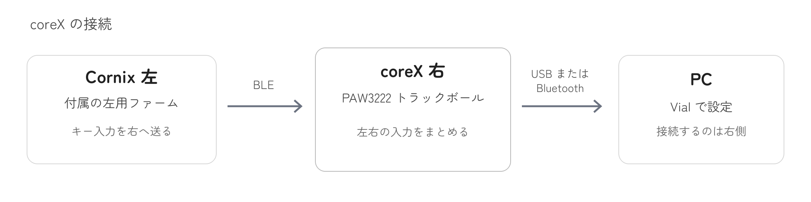

# CoreX Proto RMK

CoreX右基板のPAW3222トラックボールと、純正Cornixの左キーボードを組み合わせるRMKファームウェアです。右側をPCにつなぎ、キー配列・感度・スクロール量をVialで変更できます。

- **書き込み済みのセットを使う：** [接続と操作](docs/usage.md)
- **CoreXを更新する：** [バックアップと更新手順](docs/flashing.md#corex-を更新する)
- **純正Cornix左を初めて組み合わせる：** [左の書き換え](docs/flashing.md#純正-cornix-左を初めて使う)

## ダウンロード

| 書き込む基板 | ファームウェア |
| --- | --- |
| CoreX右・PAW3222 | [右用 v0.9.6](firmware/CoreX-Right-Central-PAW3222-RMK-v0.9.6.uf2) |
| 純正Cornix左 | [左用 v0.9.0](firmware/coreX-Cornix-StockLeft-Peripheral-RMK-v0.9.0.uf2) |

[説明書・ソースを含むZIP](https://github.com/yuchamichami/CoreX-Proto-RMK/releases/latest/download/CoreX-firmware-hand-off.zip) · [リリース一覧](https://github.com/yuchamichami/CoreX-Proto-RMK/releases)

この左右を組み合わせて使います。左v0.9.0を導入済みなら、更新は右だけです。**左右のUF2を取り違えないでください。** 純正Cornix右用のファームは、CoreX右には使えません。

v0.9.5からの更新では、PCのBluetooth登録をやり直す必要はありません。v0.9.4以前から更新する場合は、電池残量の表示に対応するため、[更新手順](docs/flashing.md#corex-を更新する)に沿って一度だけ登録し直します。

## 使い始める

左右に上記のファームが入っていれば、電源をONにして**右側をPCにUSB接続**します。左は右へ自動で無線接続します。左右のキーとボールが動けば使い始められます。

Bluetoothでは、PCに **`Cornix TB`** を登録します。右側の電池残量も確認できます。表示はmacOS 15.2で確認しています。[Bluetoothの接続手順](docs/usage.md#pc-と-bluetooth-接続する)

初期配列でのトラックボール操作は次のとおりです。

- **移動：** ボールを回します。
- **クリック：** ボールを動かした直後に、Jで左クリック、Kで中クリック、Lで右クリックします。
- **スクロール：** Iを長押ししながらボールを回します。Iを短く押すと文字のIを入力します。

ボール操作後は、J・K・Lが約0.7秒間クリック用に切り替わります。この自動切り替えをAMLと呼び、VialでON／OFFを選べます。[初期配列と操作の詳細](docs/usage.md#初期配列)

## Vialで調整する

右をUSB接続して[Vial](https://get.vial.today/)を開き、**`CoreX PAW3222`** を選びます。キーは画面上の配列から、トラックボールはLayer 0の「感度」「Scroll」「AML」欄から変更できます。設定は本体に保存され、再起動後も残ります。

「感度」などの欄は設定用です。クリックしただけでは値は変わらず、下の**User**タブで値を選びます。[画像付きの設定手順](docs/usage.md#vial-で変更する)

## 純正Cornixとの違い・対応範囲

- PCにつなぐのは右側です。左側にも、このリポジトリのファームが必要です。
- 通常キーと数字・記号のFn配列は純正を基にし、トラックボール用の操作を加えています。Vialの保存ファイルは純正用と分けて管理します。
- 右エンコーダはスクロールと中クリック、左は音量調整とミュートです。
- **純正の接続・電池状態を示すLED表示には対応していません。** 接続はキー入力で、右の電池残量はPCのBluetooth画面で確認します。

対象は右のJ4に接続したPAW3222です。トラックポイントとタッチパッドには対応していません。純正の無線ドングルとの接続や電池持ちは未確認です。[検証状況](docs/validation.md)

## 困ったとき・開発

[症状別の対処](docs/usage.md#困ったとき) · [不具合の報告](docs/usage.md#解決しない場合) · [純正Cornix左へ戻す](docs/flashing.md#純正-cornix-左へ戻す)

[ビルド手順](BUILDING.md) · [変更履歴](CHANGELOG.md) · [ライセンスと使用ライブラリ](THIRD_PARTY_NOTICES.md)

[RMK](https://github.com/rmk-rs/rmk)をベースにしています。Cornixメーカーの公式ファームウェアではありません。
