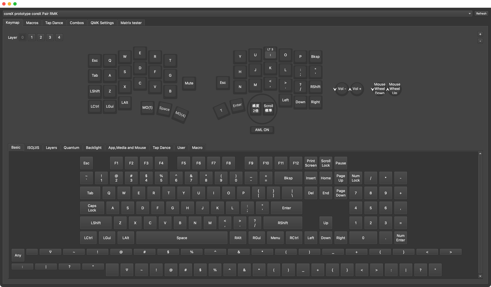
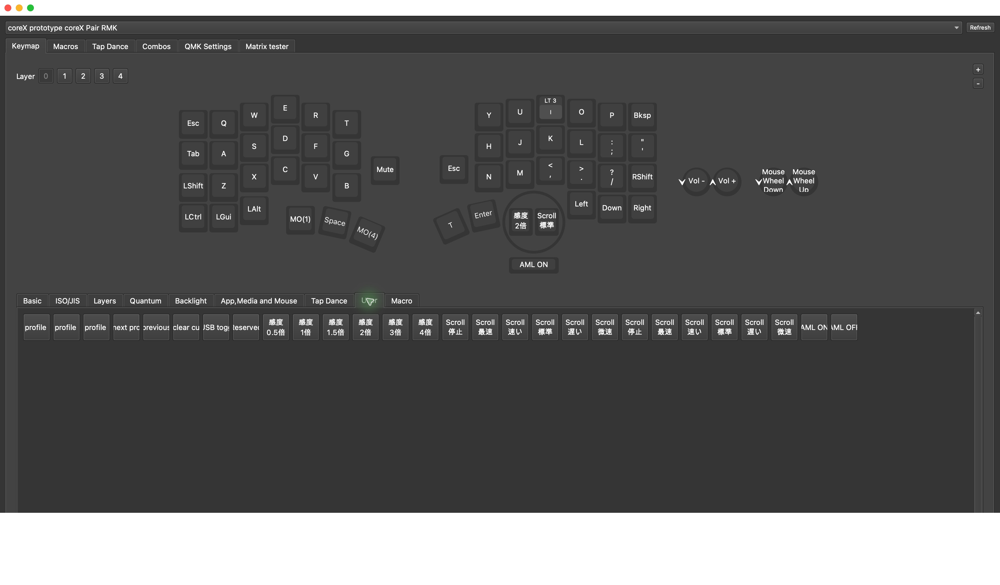

# coreX の使い方

対象は **coreX A13 右＋PAW3222 トラックボール**と、このリポジトリのファームを書き込んだ**純正 Cornix 左**の組み合わせです。右 v0.9.2／左 v0.9.0 を使用します。

## まず使う

1. 左右の電源を ON にします。
2. **右側を PC へ USB 接続**します。左右は無線でつながるので、左を PC へ接続する必要はありません。
3. 左右の文字キーと、右のボールを試します。

書き込み済みのセットなら、毎回の RESET や左右ペアリング操作は不要です。初回は左右が自動で接続先を探し、接続後は相手を記憶します。まだ純正ファームの左を使っている場合は、先に[書き込み手順](flashing.md)を実施してください。

## トラックボールの基本操作

以下は、配布ファームの**初期配列**での操作です。Vial で変更した個体では、保存済みの割り当てが優先されます。

| したいこと | 操作 |
| --- | --- |
| ポインターを動かす | ボールを回す |
| 左クリック | ボールを動かした直後に **J** |
| 中クリック | ボールを動かした直後に **K** |
| 右クリック | ボールを動かした直後に **L** |
| スクロール | **I を長押ししながらボールを回す**。上下・左右に対応 |
| I を入力する | I を短く押して離す |
| 右エンコーダ | 回転で上下スクロール、押し込みで Esc |
| 左エンコーダ | 回転で音量調整、押し込みでミュート |

I の長押し判定は初期値 **200 ms** です。他のキーを組み合わせると、長押しとして早めに判定されることがあります。

### J・K・L がクリックになる仕組み：AML

AML は Auto Mouse Layer の略で、ボールを動かすと自動でマウス用の **Layer 2** に切り替わる機能です。初期状態では ON です。

- 最後のボール操作から約 **700 ms** 後に、自動で切り替えたレイヤーを解除します。
- クリック操作でも待ち時間を延長するので、続けてクリックできます。
- 通常の文字キーなどを押すと解除されます。

ボールに触れた直後に J・K・L を文字として使いたい場合は、少し待つか AML を OFF にしてください。OFF にしてもポインター移動と「I 長押し＋ボール」のスクロールは使えます。I を長押ししている間の Layer 3 にも J・K・L のクリック割り当てがあります。

## Vial で配列・感度・AML を変える

[Vial アプリ](https://get.vial.today/)を起動し、右を USB 接続して、上の機器一覧から **coreX prototype coreX Pair RMK** を選択します。USB 機器／Bluetooth の製品名は `coreX Pair RMK` です。左だけを USB 接続しても、Vial の設定対象にはなりません。

*画面は実機の保存済み配列の例です。画像の右親指の T は個別設定で、配布ファームの初期値は右親指 MO(1) です。初期感度は 2 倍です。*

### 普通のキー

上の配列から変更したいキーをクリックし、下の一覧から割り当てたいキーを選びます。変更はその場で本体へ保存されます。[Vial の基本操作](https://get.vial.today/manual/first-use.html)

### 感度・スクロール量・AML

1. **Layer 0** を選びます。
2. トラボの円の中にある **「感度」か「Scroll」**、または円の下の **「AML」** 枠をクリックします。
3. 下の **User** タブ（Tap Dance と Macro の間）から、その枠に対応する設定を選びます。

**この3枠は設定欄です。実物にボタンはありません。** 「キーを割り当てる」と同じ操作で設定値を保存します。画面の枠を何度も押して増減させる方式ではありません。

| 枠 | 選べる設定 | 初期値 |
| --- | --- | --- |
| 感度 | 0.5／1／1.5／2／3／4 倍。縦横共通 | 2 倍 |
| Scroll | 停止／最速／速い／標準／遅い／微速。縦横共通 | 標準 |
| AML | `AML ON`／`AML OFF` | ON |

感度の倍率は、このファーム内の基準に対する倍率です。OS のポインター速度設定も最終的な速さに影響します。Scroll は「標準」に対し、最速 3 倍、速い 1.5 倍、遅い 0.75 倍、微速 0.5 倍です。**Scroll の設定はボールのスクロール量だけ**を変え、エンコーダには影響しません。

設定は再起動後も残ります。感度を変えるときは感度枠、AML を変えるときは AML 枠を選んでください。`Legacy trackball scrolling` は旧版との互換用なので、新しく設定するときは通常の `Trackball scrolling` を使います。

### エンコーダの見方

純正 Cornix の Vial 表示に合わせ、配列の外側に回転操作用の丸を4つ並べています。**左から順に「左エンコーダの反時計回り／時計回り」「右エンコーダの反時計回り／時計回り」**です。

丸を選んで、その回転方向に割り当てるキーを変更します。押し込みは、配列内にある四角い Esc／Mute のキーで設定します。丸4つはトラボの感度設定とは別です。各レイヤーごとに割り当てられます。

### 配列の保存

Vial の **File → Save current layout** で `.vil` を保存できます。戻すときは **File → Load saved layout** を使います。coreX 用の保存ファイルと、純正 Cornix 用の保存ファイルは分けて保管してください。

初期レイヤーと Bluetooth 操作

### レイヤー一覧

| Layer | 用途 | 呼び出し方 |
| --- | --- | --- |
| 0 | 通常入力 | 通常時 |
| 1 | Fn。左は数字・記号、右は左手文字の補助配列 | `MO(1)` の親指キーを押している間 |
| 2 | マウスクリック | AML が ON のとき、ボール操作で自動切り替え |
| 3 | ボールのスクロール＋クリック | I を長押ししている間 |
| 4 | Bluetooth 接続先・USB/BLE 切り替え | 左親指の `MO(4)` を押している間 |

Vial の `MO(n)` は「押している間だけ Layer n」、`LT(3, I)` は「短く押すと I、長押しで Layer 3」という意味です。Layer 1 の内部名は `Left letters` ですが、左右ペアでもこの名前を引き継いでいます。

### PC と Bluetooth 接続する

左右の無線接続と、PC への Bluetooth 登録は別です。PC には右側の **coreX Pair RMK** を登録します。

1. 左右の電源を ON にします。
2. 左親指の `MO(4)` を押しながら、右の **Y** を短く押して離し、`BLE profile 1` を選びます。未登録のプロファイルが登録待ちになります。
3. PC の Bluetooth 設定で `coreX Pair RMK` を選び、登録します。
4. 右の USB を抜き、電池で左右のキーとボールが動くことを確かめます。

登録済みの別の PC へ切り替えるときも、使いたいプロファイルを短く押して選びます。

| Layer 4 で押す位置（Layer 0 の文字） | 機能 |
| --- | --- |
| 右 Y／U／I | BLE profile 1／2／3 |
| 右 O | USB BLE toggle：USB／BLE の優先出力切り替え |
| 右 P | 次の BLE profile |
| 右 Backspace | 現在のプロファイルの PC 登録を消去 |
| 左 Esc／Q／W | BLE profile 1／2／3 |
| 左 E／R／T | USB BLE toggle／次の profile／現在の PC 登録を消去 |

**プロファイルのキーは短く押してください。約5秒の長押しは、そのプロファイルの登録消去です。** 接続先を切り替えるだけなら、登録を消す必要はありません。

譲り受けた個体に前の PC の登録が残っている場合は、まず空いているプロファイルを選びます。登録をやり直す場合は、消したいプロファイルを選んでから `BLE clear current bond` を押し、PC 側にも古い登録があれば削除して再登録します。この操作で左右の接続先を消す必要はありません。

Vial の User にある **Reserved は使いません**。内部的には左右の登録を消す機能に割り当てられているため、通常の操作キーへ置かないでください。

## 困ったとき

| 症状 | まず確認すること |
| --- | --- |
| 左だけ反応しない | 左の電源と充電。左がこのリポジトリの Peripheral ファームになっているか |
| USB を挿しても Vial に出ない | **右側**へ、データ通信できるケーブルで接続。書き込みドライブが出ていたら RESET を1回押して通常起動 |
| USB 接続中なのに入力先がおかしい | Layer 4 の `USB BLE toggle` で優先出力を確認 |
| J・K・L が文字にならない | AML 中の可能性。ボールを止めて約700 ms待つか AML OFF |
| クリックできない | AML ON でボールを動かした直後に試すか、I 長押し中に試す |
| ボールでスクロールできない | I を長押ししているか、Scroll が「停止」になっていないか |
| エンコーダは回せるのに押し込みだけ無反応 | Vial の押し込み割り当てを確認。回転と押し込みは別の接点なので、片方だけの接触不良もあります |

RESET **1回は再起動**、**素早く2回は書き込みモード**です。通常の再起動で配列・感度・ペアリング設定は消えません。

## 純正 Cornix から変わる点

| 項目 | 純正 Cornix | この構成 |
| --- | --- | --- |
| PC と接続する側 | 左側 | **右側** |
| 左のファーム | メーカーの純正ファーム | 付属の coreX Left Peripheral が必要 |
| ポインティング | 本リポジトリの PAW3222 制御はなし | 右 J4 の PAW3222、感度・スクロール・AML を Vial で設定 |
| キー配列 | メーカーの初期配列 | coreX 用5レイヤー。純正の `.vil` をそのまま流用する前提ではありません |
| エンコーダ表示 | 回転操作用の丸4つ | 純正と同じ表示形式。トラボ設定の円は追加 |
| 状態 LED | 接続・電池状態などを表示 | 純正の状態表示は未移植。LED の点灯・消灯で接続を判定しないでください |

純正側の接続方法・LED 仕様は[メーカー日本語マニュアル](https://docs.channel.io/jezailfunderjp/ja/articles/Cornix-%E6%97%A5%E6%9C%AC%E8%AA%9E%E3%83%9E%E3%83%8B%E3%83%A5%E3%82%A2%E3%83%AB-c1160246)を確認しています。このファームでは左の RGB 制御ピンと右の LED 制御ピンを LOW にしています。充電回路の表示とファームの状態表示は区別してください。

v0.9.2 は **PAW3222 トラボ専用**です。J3 のトラックポイントや IQS9151 タッチパッドは初期化しません。純正の無線ドングル・省電力動作・電池持ちまで同等とするものではありません。
