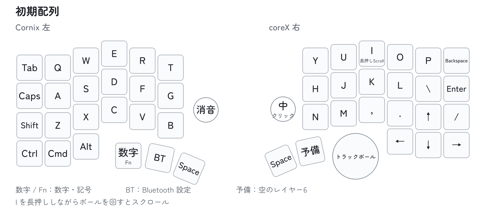

# CoreX の使い方

CoreX右のPAW3222トラックボールと、専用ファームを書き込んだ純正Cornix左を使います。以下は左右v0.10.0の初期配列での操作です。

[接続](#接続) · [トラックボール](#トラックボール) · [Vialで調整](#vial-で変更する) · [困ったとき](#困ったとき)

ファームを更新する場合は、先に[書き込みガイド](flashing.md#corex-を更新する)を参照してください。

## 接続

### USB で接続する

1. 左右の電源を ON にします。
2. **右側を PC に USB 接続**します。左側は無線で右につながります。
3. 左右のキーで文字を入力し、ボールでポインターが動くことを確認します。

未登録の左右は起動後60秒間に接続し、相手を記憶します。次回からは登録した相手だけに再接続します。初回に接続できなかった場合は、[左右の登録をやり直します](#左右の登録をやり直す)。左がまだ純正ファームの場合は、先に[書き込み手順](flashing.md#純正-cornix-左を初めて使う)を進めてください。

接続状態は[LED表示](#led表示)でも確認できます。

### PC と Bluetooth 接続する

PC には右側の **`Cornix TB`** を登録します。左右の無線接続は、PC への登録とは別に行われます。

1. 左右の電源を ON にします。
2. 左親指の中央にある **Bluetoothキー（Vialでは `MO(4)`）** を押しながら、左の **Caps Lock** を短く押して離します。PCの登録先1（`BLE 1`）が選ばれ、未登録なら登録待ちになります。
3. PC の Bluetooth 設定で `Cornix TB` を選び、登録します。
4. 右の USB ケーブルを抜き、左右のキーとボールが動くことを確認します。

#### 電池残量

macOS 15.2では、Bluetooth設定の `Cornix TB` に右側の電池残量が表示されます。Bluetoothで接続した状態で確認してください。

表示は右側の電池電圧から推定した目安です。PCの標準表示に左側の％は出ませんが、左の残量低下は右のLEDで知らせます。残り使用時間は表示しません。ほかのOSでの表示や、残量の精度は[検証状況](validation.md)を参照してください。

#### 接続する PC を切り替える

PCの登録先は3つあります。左親指のBluetoothキー（`MO(4)`）を押しながら、左側の次のキーを短く押します。

- **Caps Lock：** 登録先1（`BLE 1`）
- **Shift：** 登録先2（`BLE 2`）
- **Ctrl：** 登録先3（`BLE 3`）

v0.10.0では、登録先のキーを長押ししても登録を消しません。右だけを使う場合は、次の接続キーが使えます。

右親指の **接続キー（`MO(6)`）** を押しながら操作します。

| 右のキー | 操作 |
| --- | --- |
| Y / U / I | PCの登録先1 / 2 / 3 |
| O | 次のPCへ切り替え |
| P | USB／Bluetoothの優先出力を切り替え |
| Backspaceを5秒長押し | 現在のPC登録を消去 |
| Hを5秒長押し | 左右の登録をやり直す |

保存済みの割り当てはUF2更新後も残り、未保存の項目には新しい初期値が入ります。上の操作がない場合は、VialのLayer 6に各User機能を割り当てます。初期配列を読み込む方法もありますが、先に現在の配列を保存してください。

#### PC の登録をやり直す

PCへの接続をやり直すときの手順です。v0.9.4以前のファームから更新した場合も、一度だけこの操作が必要です。**v0.9.5以降からの更新では不要です。**

1. PCのBluetooth設定から、`Cornix TB`（旧版では `coreX Pair RMK`）の登録を削除します。
2. 消したい登録先を選び、右親指の接続キー（`MO(6)`）を押しながらBackspaceを5秒長押しして離します。長押し中はほかのキーを押しません。
3. PCのBluetooth設定で `Cornix TB` を選び、登録し直します。

キー配列と左右の接続先、ほかのPCの登録は残ります。配列を変更していて上の操作が使えない場合は、右をUSB接続し、VialのUserタブで「PC登録 解除」（`BLE clear current bond`）を任意のキーへ割り当てます。消したい登録先を選んでからそのキーを5秒長押しし、登録し直します。作業後は元の割り当てに戻します。

#### 接続操作のキーを追加する

Vial の **User** タブから、次の機能を任意のキーへ割り当てられます。

- **USB ⇄ BLE：** USB／Bluetooth の優先出力を切り替えます。
- **次のPC：** 次の登録先へ切り替えます。
- **PC登録 解除：** 5秒長押しで現在選んでいるPCの登録を消去します。

初期配列では右親指の接続キー（`MO(6)`）と組み合わせて使えます。

## LED表示

普段は消灯します。状態が変わったときだけ点滅し、スリープ中は点灯しません。充電回路のLEDとは別の表示です。

| 状態 | CoreX右 | 純正Cornix左 |
| --- | --- | --- |
| 左右が接続 | D22が2回 | 状態LEDが緑で2回 |
| 左右が切断 | D22が3回 | 状態LEDが青で3回 |
| PCに接続 | D22が1回、やや長く点灯 | — |
| PCの登録先を変更 | D22が登録先1／2／3に合わせて1／2／3回 | — |
| 右の電池が20％以下 | D21が1回 | — |
| 左の電池が20％以下 | D21が2回 | 電池LEDが赤で1回 |
| 左右のペアリング開始 | D21・D22が同時に3回 | 2個とも青で3回 |

電池警告は測定更新時に出し、連続して点滅しないよう1分以上空けます。残量が25％以上になるか、充電中になると警告を解除します。右のLEDは単色なので、色ではなく位置と回数で区別します。

## スリープと復帰

5分間キーやボールを操作しないと、省電力の待機に入ります。キーを押している間は入りません。接続中のBluetoothは維持し、左右のキーや右のボールを動かすと復帰します。通常の復帰でRESETや再登録は不要です。

ボールのセンサーは電源を保ち、最初の動きを使って復帰します。毎回の再初期化や、復帰した直後のデータの読み捨てはしません。

PCや左側との接続自体が切れていた場合は、再接続を待ってから入力してください。PCの登録待ちが終了して見つからない場合は、キーを押すかボールを動かして登録待ちを再開します。

接続を保って復帰する動作は[純正Cornixの説明](https://docs.channel.io/jezailfunderjp/ja/articles/Cornix-日本語マニュアル-c1160246)に合わせています。**5分はCoreXの設定値**です。純正の待機時間は公開されていません。電池持ちと実機での復帰確認の範囲は[検証状況](validation.md)を参照してください。

## 初期配列

通常のキーと数字・記号の Fn 配列は、純正 Cornix の位置に揃えています。

*配布ファイルから描いた初期配列図です。実機の画面ではありません。*

- **左の親指キー：** 左から `MO(1)`（Fn）、`MO(4)`（Bluetooth）、Space。
- **右の親指キー：** Space と `MO(6)`（接続操作）。純正の `MO(2)` の位置にはトラックボールがあります。
- **数字・記号：** 左親指の `MO(1)` を押している間に使います。上段が数字、左右の内側に記号を配置しています。

Fn や Bluetooth レイヤーの空欄は、純正と同じ「何もしない」キーです。押しても通常の文字は入力されません。

## トラックボール

- **ポインター移動：** ボールを回します。
- **クリック：** ボールを動かした直後に、J で左クリック、K で中クリック、L で右クリックします。
- **スクロール：** I を長押ししながらボールを回します。上下・左右に対応しています。
- **I の文字入力：** I を短く押して離します。

I の長押し判定は初期値で 200 ms です。他のキーを組み合わせると、長押しとして早めに判定されることがあります。

### クリックへの自動切り替え（AML）

AML（Auto Mouse Layer）は、ボールを動かすと J・K・L をクリックに切り替える機能です。初期設定は ON です。

ボールを止めてから約0.7秒で通常の文字入力に戻ります。クリックを続けると、この待ち時間も延長されます。ほかの文字キーなどを押したときは、その時点で解除されます。

ボールを動かした直後に J・K・L を文字として入力するには、約0.7秒待ちます。自動切り替えを使わない場合は、[Vial で AML を OFF](#trackball-settings) にできます。OFF のときもポインター移動と I 長押しによるスクロールは使えます。I を押し続けている間は、J・K・L でクリックもできます。

## エンコーダ

- **右：** 反時計回りで上スクロール、時計回りで下スクロール、押すと中クリック。
- **左：** 反時計回りで音量を下げ、時計回りで音量を上げ、押すとミュート。

回転と押し込みの割り当ては、Vial で個別に変更できます。

## Vial で変更する

右側を USB 接続して [Vial アプリ](https://get.vial.today/)を開き、機器一覧から **`CoreX PAW3222`** を選びます。左だけを USB 接続しても、Vial では設定できません。

*配布する初期配列とVial定義から作った説明図です。実機のスクリーンショットではありません。*

### ロック解除とキーテスター

通常のキー割り当てや感度変更は、そのまま操作できます。マクロの書き込み・設定消去・書き込みモードへの移行・キーテスターは、先にVialの **Security → Unlock** を選び、**右のYとBackspaceを、画面の進捗バーが完了するまで同時に押し続けます**。キーの割り当てを変更していても物理位置は同じです。

再起動・設定消去などのキーを割り当てるときや、自分で保存した配列を読み込むときも、先に解除してください。Vialの版によっては、保護対象の変更が拒否されても画面に反映されたように見えるためです。同梱の初期配列ファイルには保護対象のキーやマクロを含めていません。

キーテスターでは、押した位置が画面で反応するか確認できます。作業後はVialでロックするか、本体を再起動します。

### キーの割り当て

上の配列で変更するキーをクリックし、下の一覧から割り当てを選びます。変更はその場で本体に保存され、再起動後も残ります。詳しい操作は [Vial の基本操作](https://get.vial.today/manual/first-use.html)を参照してください。

### 感度・スクロール量・AML

1. **Layer 0** を選びます。
2. 円の中の **「感度」「Scroll」**、または円の下の **「AML」** から、変更する欄をクリックします。
3. 下の **User** タブ（Tap Dance と Macro の間）を開き、その欄の設定値を選びます。

*感度1.5倍を選ぶ例です。枠は説明のために付けています。*

この3つは設定用の欄で、実物のボタンには対応していません。欄をクリックしただけでは値は変わらず、Userタブで値を選ぶと本体に保存されます。

- **感度：** 0.5／1／1.5／2／3／4倍。初期値は **2倍**です。
- **Scroll：** 停止／最速／速い／標準／遅い／微速。初期値は **標準**です。
- **AML：** `AML ON`／`AML OFF`。初期値は **ON**です。

例えば、ポインターが速すぎる場合は「感度」欄を選び、Userタブで「感度1.5倍」を選びます。ボールを回して変化を確かめ、合わなければ同じ操作で戻せます。

感度とScrollは縦横共通で、再起動後も設定が残ります。OS側のポインター速度やスクロール設定も操作感に影響します。

感度の倍率は、このファーム内の基準に対する値です。Scroll は「標準」に対し、最速が3倍、速いが1.5倍、遅いが0.75倍、微速が0.5倍です。Scroll で変わるのはボールのスクロール量だけで、エンコーダには影響しません。

スクロール用のキーを別に置く場合は、Layersタブの `MO(3)` を割り当てます。そのキーを押している間、ボールがスクロールになります。Userタブの「Scroll」は量を決める設定値で、モードを切り替えるキーではありません。「旧Scroll」と付いた選択肢は旧版との互換用です。

「左右登録 リセット」（`Reset split pairing (hold 5s)`）は左右の登録を消す操作です。PCの登録をやり直すときには使いません。[再起動と登録削除の違い](#再起動と登録削除)を参照してください。

### エンコーダの割り当て

配列の右外側にある丸4つが、回転操作の設定です。左から順に、左エンコーダの反時計回り・時計回り、右エンコーダの反時計回り・時計回りに対応します。

変更する丸を選び、下の一覧から割り当てます。押し込みは、配列内にある四角いキーを選びます。初期値は左が Mute、右が中クリックです。回転・押し込みとも、レイヤーごとに設定できます。

### 配列の保存と読み込み

- **保存：** File → Save current layout で `.vil` ファイルを保存します。
- **読み込み：** [ロックを解除](#ロック解除とキーテスター)してから、File → Load saved layout で保存した `.vil` を選びます。

CoreX 用と純正 Cornix 用の保存ファイルは、分けて管理してください。

配列全体を現在の初期値に揃える場合は、[CoreX-Cornix-default.vil](../keymaps/CoreX-Cornix-default.vil) を読み込みます。キーとエンコーダの割り当てに加え、感度2倍・Scroll標準・AML ONが適用されます。マクロなどの設定は変更しません。適用前に現在の配列を保存してください。

## 困ったとき

- **左だけ反応しない：**
  左の電源と充電を確認します。左には、このリポジトリの左用ファームが必要です。
- **Vial に表示されない：**
  右側を、データ通信できる USB ケーブルで接続します。書き込み用の USB ドライブが表示されている場合は、RESET を1回押して通常起動します。
- **更新後もBluetoothの電池残量が表示されない：**
  PCに古い機器情報が残っている場合があります。[PCの登録をやり直し](#pc-の登録をやり直す)、Bluetoothで接続します。表示するのは右側の残量です。
- **USB 接続中に、別の PC へ入力される：**
  VialのUserタブで「USB ⇄ BLE」を任意のキーに割り当て、そのキーを押して優先出力を切り替えます。
- **J・K・L が文字にならない：**
  ボールを止めて約0.7秒待ちます。自動切り替えが不要なら、Vial で AML を OFF にします。
- **クリックできない：**
  AML が ON なら、ボールを動かした直後に J・K・L を押します。I を長押ししている間もクリックできます。
- **ボールでスクロールできない：**
  I を長押ししているか、Scroll が「停止」になっていないかを確認します。
- **エンコーダの押し込みだけ反応しない：**
  Vial で押し込み用の四角いキーを確認します。初期値は左が Mute、右が中クリックです。回転と押し込みは別の接点なので、片方だけ接触不良になる場合もあります。

### 再起動と登録削除

RESETボタンでの再起動と、Bluetoothの登録削除は別の操作です。

| 操作 | 変わるもの | 残るもの |
| --- | --- | --- |
| RESETを1回押す | 再起動する | 配列・感度・PCと左右の登録 |
| RESETを素早く2回押す | UF2を書き込むモードに入る | 配列・感度・PCと左右の登録 |
| `BLE 1`〜`BLE 3`を押す・長押しする | PCの接続先を切り替える | 全ての登録と配列 |
| 「PC登録 解除」を約5秒長押し | 現在選んでいるPCの登録を消す | 配列・感度・ほかのPCと左右の登録 |
| 「左右登録 リセット」を約5秒長押し | 左右の接続先を消す | 配列・感度・PCの登録 |

左右の登録削除は通常の更新やPCの再登録には不要です。左が反応しない場合も、まず電源・充電・ファームの組み合わせを確認してください。

### 左右の登録をやり直す

通常の電源OFFや一時的な切断では、登録を消す必要はありません。左を交換したときや、以前の別セットの登録が残っているときに使います。

1. 右親指の接続キー（`MO(6)`）を押しながら、Hを5秒長押しします。Vialで割り当てた「左右登録 リセット」も同じ操作です。
2. 左右がつながっていた場合は、左の登録も解除して自動でつなぎ直します。左が不在だった場合や交換する場合は、つなぐ左を近くへ置き、**未接続の状態でTabとTを同時に5秒長押し**します。配列を変更していても、物理位置は同じです。
3. 接続できたら左のキーで入力を確認します。60秒以内につながらなければ、右の操作と未接続の左の操作を繰り返します。

操作中は、登録し直す1セットだけを起動してください。通常の再接続で別の左へ乗り換えることはありません。PCの登録やキー配列は残ります。

### 解決しない場合

[GitHub Issues](https://github.com/yuchamichami/CoreX-Proto-RMK/issues)で、次の情報を添えて報告してください。

- 左右に書き込んだファームの版と、PCのOS・バージョン。
- USBとBluetoothのどちらで使っているか、右・左のどちらで起きるか。
- 問題が起きる操作と、期待した動作。毎回か、ときどきかも分かると役立ちます。
- 初期配列のままか、Vialで変更しているか。

## 初期レイヤー

レイヤーはキーの役割を切り替える仕組みです。`MO(n)` は「押している間だけ Layer n」、`LT(3, I)` は「短く押すと I、長押しで Layer 3」を意味します。

- **Layer 0：** 通常入力。純正配列に I の長押し操作とトラックボールの設定欄を加えています。
- **Layer 1：** 数字・記号。左親指の `MO(1)` を押している間に使います。
- **Layer 2：** クリック。AML が ON のとき、ボール操作で自動的に切り替わります。
- **Layer 3：** スクロールとクリック。I を長押ししている間に使います。
- **Layer 4：** Bluetooth の登録先選択。左親指の `MO(4)` を押している間に使います。純正 Layer 3 の配列です。
- **Layer 5：** Bluetooth の登録先選択。純正 Layer 2 の配列を残しています。初期配列に呼び出しキーはありません。
- **Layer 6：** 接続操作。右親指の `MO(6)` で呼び出します。PCの切り替えと登録のやり直しに使います。

純正の Layer 5～9 は通常キーが未割り当てのため、省略しています。Layer 5 を使う場合は、Vial で任意のキーに `MO(5)` などを割り当てます。

## 対応範囲

配布ファームは右J4のPAW3222トラックボールに対応しています。J3のトラックポイントとIQS9151タッチパッドには対応していません。純正 Cornix の無線ドングル、省電力動作、電池持ちとの同等性は未確認です。

純正 Cornix の接続方法と LED 表示は[メーカー日本語マニュアル](https://docs.channel.io/jezailfunderjp/ja/articles/Cornix-%E6%97%A5%E6%9C%AC%E8%AA%9E%E3%83%9E%E3%83%8B%E3%83%A5%E3%82%A2%E3%83%AB-c1160246)で確認できます。充電回路による表示は、ファームによる接続・電池状態の表示とは別です。
